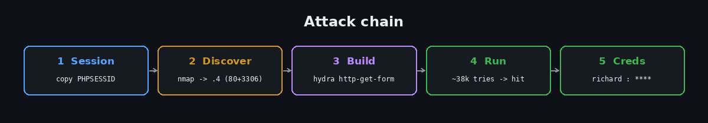
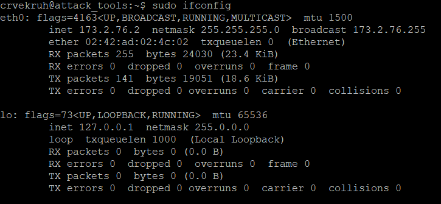
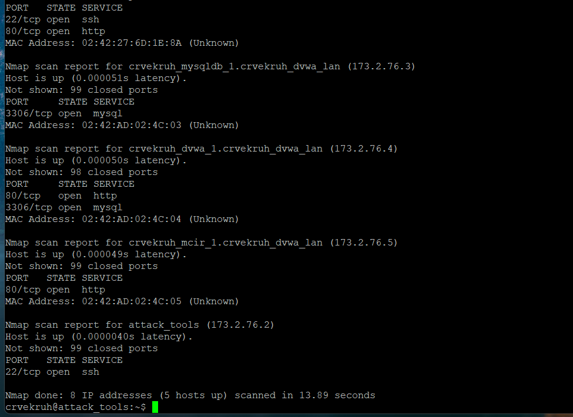
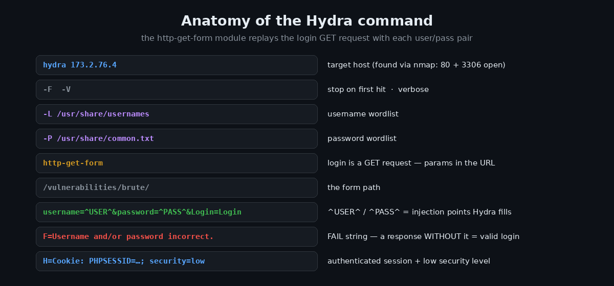
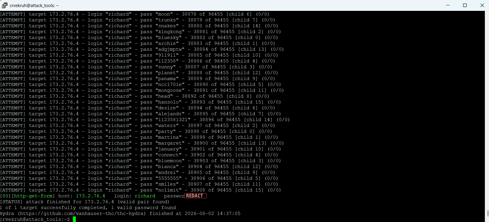

# Brute Force in DVWA — Cracking a Login Form with Hydra


A walkthrough of an online credential brute-force against DVWA's **Brute Force** login form. The form applies no rate limiting, lockout, or CAPTCHA, so an automated tool can try tens of thousands of username/password pairs unimpeded. Run from a provided attack box: discover the target with `nmap`, then drive [Hydra](https://github.com/vanhauser-thc/thc-hydra) against the login form. The interesting part of this one was **debugging false positives** — a subtle Hydra parsing gotcha that made every guess look like a hit until it was isolated with `curl`.

> ⚠️ **Disclaimer** — Performed against an authorized lab instance of the intentionally vulnerable [Damn Vulnerable Web Application (DVWA)](https://github.com/digininja/DVWA), from the exercise's own attack machine. Never run credential attacks against systems you don't own or have explicit permission to test.



---

## Table of Contents
- [TL;DR](#tldr)
- [Environment](#environment)
- [Step 1 — Grab the session cookie](#step-1--grab-the-session-cookie)
- [Step 2 — Recon: find the target](#step-2--recon-find-the-target)
- [Step 3 — Understand the Hydra command](#step-3--understand-the-hydra-command)
- [Step 4 — Debugging false positives](#step-4--debugging-false-positives)
- [Step 5 — Run the attack (for real)](#step-5--run-the-attack-for-real)
- [Why it works](#why-it-works)
- [Impact](#impact)
- [Remediation](#remediation)
- [Key takeaways](#key-takeaways)
- [References](#references)

---

## TL;DR

The login form has no anti-automation controls. From the attack box:

```bash
sudo nmap -F 173.2.76.0/29          # find the host with 80 + 3306 open  -> 173.2.76.4
hydra 173.2.76.4 -F -V -L /usr/share/usernames -P /usr/share/common.txt \
  http-get-form "/vulnerabilities/brute/:username=^USER^&password=^PASS^&Login=Login:F=incorrect:H=Cookie: PHPSESSID=<session>; security=low"
```

The `F=` failure string had to be a **single word** (`incorrect`) — multi-word strings broke Hydra's option parser and caused false positives. Recovered credentials: `richard : ****` *(password redacted)*.

---

## Environment

| | |
|---|---|
| **Target** | DVWA v1.9 — Brute Force module |
| **Security level** | `low` |
| **Form** | GET request to `/vulnerabilities/brute/` |
| **Run from** | provided attack box (`attack_tools`) over SSH |
| **Tools** | `nmap` (discovery), `hydra` (brute force), `curl` (debugging) |
| **Wordlists** | `/usr/share/usernames`, `/usr/share/common.txt` |

The exact commands are in [`commands.md`](commands.md).

---

## Step 1 — Grab the session cookie

DVWA's vulnerable pages require an authenticated session, so Hydra needs a valid **PHPSESSID** to reach the form. Log into DVWA, set **DVWA Security → low**, open the **Brute Force** page, then in dev tools (`F12` → Storage/Application → Cookies) copy the `PHPSESSID` value. Keep the page open so the session stays alive — an expired cookie causes DVWA to redirect to the main login page, which breaks the attack in a confusing way.

## Step 2 — Recon: find the target

All offensive steps run from the exercise's attack box over SSH, never from a personal machine. First, my own address:

```bash
sudo ifconfig
```



`eth0 -> inet 173.2.76.2` — subnet `173.2.76.0/24`. Scan for DVWA:

```bash
sudo nmap -F 173.2.76.0/29
```



The target is the host with **both `80/http` and `3306/mysql`** open, and the hostname confirms it:

```
crvekruh_dvwa_1.crvekruh_dvwa_lan (173.2.76.4)
  80/tcp   open  http
  3306/tcp open  mysql
```

So the Hydra target is **`173.2.76.4`**.

## Step 3 — Understand the Hydra command

The whole exercise is really about assembling one command correctly:



The `http-get-form` module replays the login GET request substituting `^USER^`/`^PASS^` from the wordlists. The two critical parts are the **match string** (how Hydra decides success vs failure) and the **`H=Cookie` header** carrying the authenticated session plus `security=low`.

## Step 4 — Debugging false positives

This is where the exercise got real. The first runs "succeeded" almost instantly — and were **wrong**:

| Run | Reported | Reality |
|---|---|---|
| `F=Username and/or password incorrect.` | `seppo : 12345678` (attempt #2) | doesn't log in |
| re-run | `qwerty` (attempt #3) | different answer — impossible |
| `-l zzz -p zzz` (impossible login) | **valid pair found** | detection is broken |

Two different "passwords" for one account, and an impossible login reported as valid, meant Hydra was flagging **every** response as success — the failure string wasn't matching, so it never saw a "this failed" signal.

**Isolating the cause with `curl`.** Instead of trusting Hydra's interpretation, I replayed the exact request and looked at the raw response:

```bash
curl -s "http://173.2.76.4/vulnerabilities/brute/?username=admin&password=<known-good>&Login=Login" \
  -H "Cookie: PHPSESSID=<session>; security=low" | grep -i "welcome\|incorrect"
```

That returned the real success page — `<p>Welcome to the password protected area admin</p>` — proving the **session and request were fine**. So the bug was purely in Hydra's matching. The culprit: **spaces in the match string**. `S=Welcome to the password protected area` and `F=Username and/or password incorrect.` both contain spaces, which collide with Hydra's colon/space-delimited option parser, so the match silently never fired.

**The fix:** shrink the condition to a single unique word with no spaces:

```
F=incorrect
```

Re-testing the known-good `admin` credential then correctly reported **valid** — end-to-end detection confirmed before trusting any real run.

> **Lesson:** when a tool's result contradicts itself, drop to the layer below it. `curl` showed the ground truth and turned "it doesn't work" into "the match string has spaces."

## Step 5 — Run the attack (for real)

With `F=incorrect` and a live session:

```bash
hydra 173.2.76.4 -F -V -L /usr/share/usernames -P /usr/share/common.txt \
  http-get-form "/vulnerabilities/brute/:username=^USER^&password=^PASS^&Login=Login:F=incorrect:H=Cookie: PHPSESSID=<session>; security=low"
```

This time the run behaved like a real brute force — churning through tens of thousands of pairs before landing a genuine hit at attempt **~38,900**:



```
[80][http-get-form] host: 173.2.76.4   login: richard   password: ****
1 of 1 target successfully completed, 1 valid password found
```

Recovered credentials: **`richard : ****`** *(password redacted)*. Verified in the browser — a correct login shows "Welcome to the password protected area." The tells that this hit is genuine (unlike the earlier false ones): it landed **deep in the list**, on a **different username** than the broken runs latched onto, and it **actually logs in**.

## Why it works

Two independent failures combine:

- **No anti-automation.** No rate limiting, lockout, backoff, or CAPTCHA, so unlimited guesses are free (CWE-307).
- **Weak password.** The account's password is a common dictionary word (CWE-521), so a wordlist finds it.

Either control alone would have largely stopped this.

## Impact

- Full account takeover of any user with a guessable password
- At scale, credential compromise across many accounts (password spraying)
- A foothold that unlocks the rest of the application's authenticated functionality

## Remediation

- **Rate-limit and lock out.** Throttle attempts per account/IP; apply exponential backoff and temporary lockouts after repeated failures (CWE-307 fix).
- **Enforce strong passwords** and screen against known-breached/common lists (CWE-521 fix).
- **Add MFA** so a correct password alone isn't sufficient.
- **CAPTCHA / bot detection** after a few failures to break automation.
- **Monitor and alert** on brute-force patterns; use generic error messages.

## Key takeaways

- **Verify every "hit."** A fast finish that reports different answers on re-runs is a false positive — confirm in the browser before trusting a tool.
- **Drop a layer to debug.** `curl` revealed the raw server response and proved the session was fine, pinpointing the match string as the real bug.
- **Tool-syntax gotchas are real.** Hydra's `http-get-form` match string can't reliably contain spaces — `F=incorrect` worked where the full sentence failed.
- **Weak-password + no-lockout** is a lethal pairing; defense needs both halves.
- **Scope discipline:** attacks were run only from the provided attack box against the internal target.

## References

- OWASP — [Blocking Brute Force Attacks](https://owasp.org/www-community/controls/Blocking_Brute_Force_Attacks)
- OWASP — [Authentication Cheat Sheet](https://cheatsheetseries.owasp.org/cheatsheets/Authentication_Cheat_Sheet.html)
- THC — [Hydra](https://github.com/vanhauser-thc/thc-hydra)
- MITRE — [CWE-307](https://cwe.mitre.org/data/definitions/307.html) · [CWE-521](https://cwe.mitre.org/data/definitions/521.html)
- [DVWA on GitHub](https://github.com/digininja/DVWA)

---

<sub>A formal PDF version of this assessment is included as <code>DVWA_Brute_Force_Report.pdf</code>. Part of my security learning portfolio.</sub>
