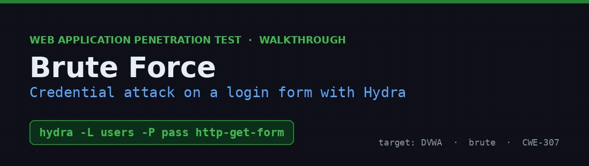

<!--
============================================================================
 REUSABLE WRITEUP TEMPLATE
 How to use:
   1. Copy this file into a new folder, e.g.  dvwa-sql-injection/README.md
   2. Make a banner:  python tools/make_banner.py \
          --title "SQL Injection" --subtitle "Union-based data extraction" \
          --payload "' UNION SELECT user,password--" --out images/banner.png
   3. Find/replace every {{PLACEHOLDER}} below.
   4. Drop screenshots into images/ and update the  paths.
   5. Delete these comment blocks when you're done.
 Keep the section order — it reads Recon -> Understand -> Exploit -> Fix,
 which is the arc reviewers expect.
============================================================================
-->



# {{VULN NAME}} in {{TARGET}} — {{ONE-LINE HOOK}}


{{2–4 sentence summary: what the vuln is, what's interesting about THIS instance,
and what the payoff was. Lead with the hook, not the theory.}}

> ⚠️ **Disclaimer** — Performed against an authorized lab instance of an intentionally
> vulnerable application. Never test systems you don't own or have permission to assess.

---

## Table of Contents
- [TL;DR](#tldr)
- [Environment](#environment)
- [Step 1 — Recon](#step-1--recon)
- [Step 2 — {{observe / probe}}](#step-2--observe)
- [Step 3 — {{understand the mechanism}}](#step-3--understand)
- [Step 4 — {{exploit}}](#step-4--exploit)
- [Step 5 — {{proof}}](#step-5--proof)
- [Why it works](#why-it-works)
- [Impact](#impact)
- [Remediation](#remediation)
- [Key takeaways](#key-takeaways)
- [References](#references)

---

## TL;DR

{{The shortest path to the win. Show the final payload/command in a code block.}}

```
{{final payload or request}}
```

{{One line on the observed result.}}

---

## Environment

| | |
|---|---|
| **Target** | {{app + version}} |
| **Module** | {{module / endpoint}} |
| **Security level** | {{low / medium / high}} |
| **Parameter / vector** | {{param (method)}} |
| **Approach** | {{black-box / grey-box (source available) / white-box}} |

---

## Step 1 — Recon

{{What you looked at first and why. If source is available, quote the relevant lines.}}


```{{php|http|sql}}
{{key snippet}}
```

{{The one or two observations that shaped your approach.}}

## Step 2 — Observe

{{Feed it benign then boundary input. Describe what changes and what that tells you.}}


## Step 3 — Understand

{{Explain the mechanism in plain terms — the "aha". A diagram here earns its place.}}


## Step 4 — Exploit

{{The build-up to the working payload. Show intermediate steps if they add insight.}}

```
{{payload}}
```


## Step 5 — Proof

{{The result: the alert, the dumped data, the shell. Screenshot from YOUR instance.}}


> _Replace with your own screenshot from your instance._

## Why it works

{{Root cause in 2–4 sentences. Name the flawed assumption the app made.}}

## Impact

{{What an attacker gains. Bullet the realistic outcomes — be concrete, not generic.}}

- {{outcome 1}}
- {{outcome 2}}
- {{outcome 3}}

## Remediation

- **{{Primary fix}}** — {{the real control, with the concrete API/config.}}
- **{{Secondary}}** — {{defense in depth.}}
- **{{Hardening}}** — {{headers, least privilege, etc.}}

## Key takeaways

- {{What you learned methodologically, not just about this bug.}}
- {{A tell or heuristic you'll reuse next time.}}

## References

- OWASP — {{link}}
- CWE — {{link}}
- {{vendor docs / cheat sheet}}

---

<sub>Part of my security learning portfolio.</sub>
