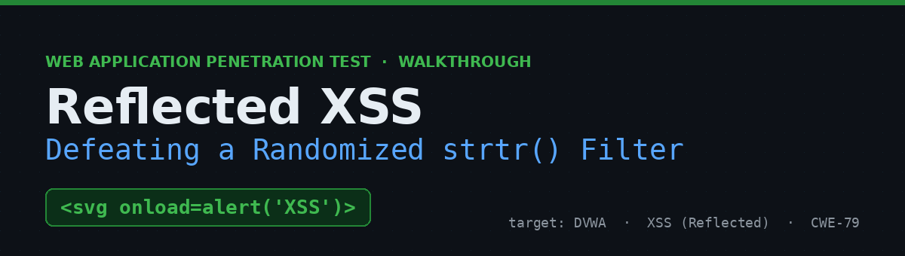
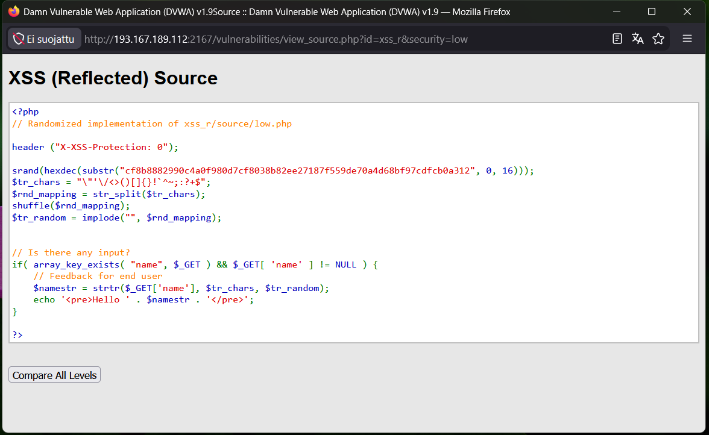
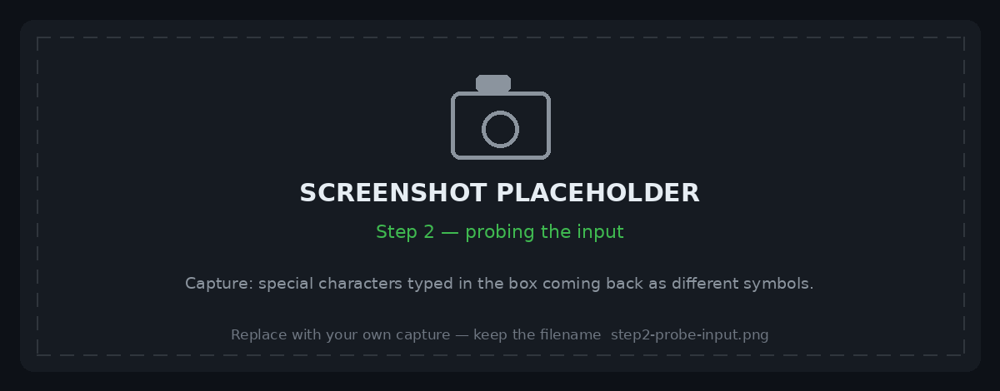
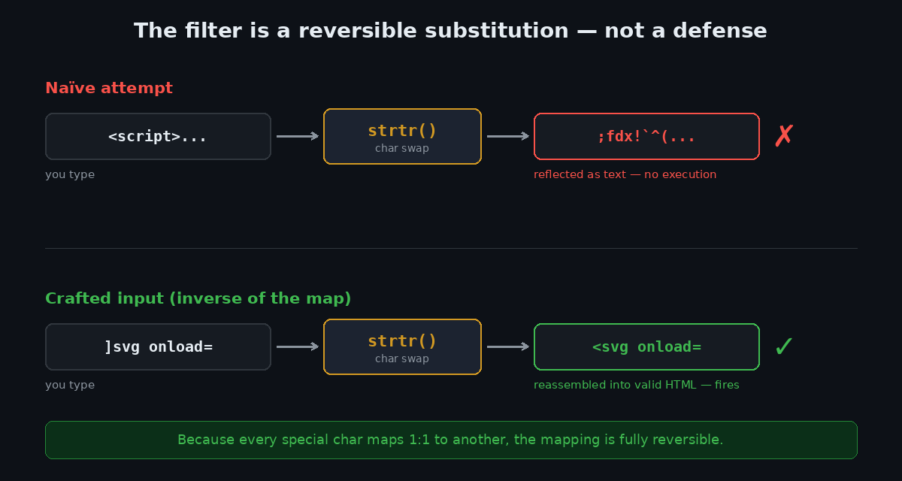
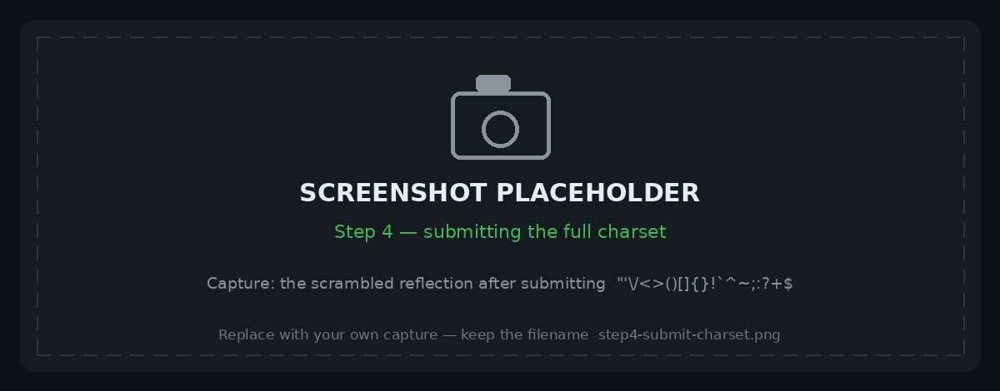
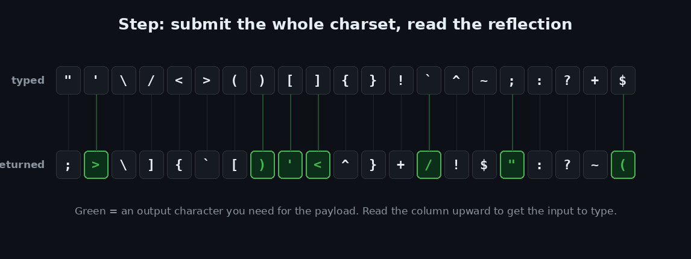
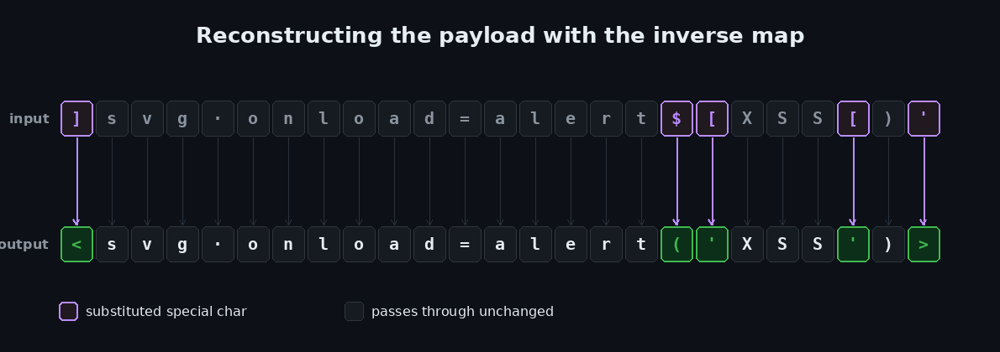
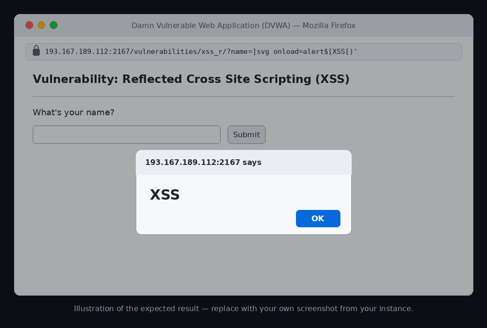

# Reflected XSS in DVWA — Defeating a Randomized `strtr()` Filter


A walkthrough of a reflected Cross-Site Scripting vulnerability in the **XSS (Reflected)** module of a "randomized" DVWA build. What makes this one interesting is that the input isn't left raw — it's run through a character-substitution filter. The twist is that the filter is a **fixed, reversible one-to-one mapping**, so instead of blocking the payload it just scrambles it. Recover the mapping, invert it, and the payload sails straight through.

> ⚠️ **Disclaimer** — This was performed against a lab instance of the intentionally vulnerable [Damn Vulnerable Web Application (DVWA)](https://github.com/digininja/DVWA) that I was authorized to test. Never run these techniques against systems you don't own or have explicit permission to assess.

---

## Table of Contents
- [TL;DR](#tldr)
- [Environment](#environment)
- [Step 1 — Recon: read the source](#step-1--recon-read-the-source)
- [Step 2 — Probe the input](#step-2--probe-the-input)
- [Step 3 — Understand the filter](#step-3--understand-the-filter)
- [Step 4 — Recover the mapping](#step-4--recover-the-mapping)
- [Step 5 — Reconstruct the payload](#step-5--reconstruct-the-payload)
- [Step 6 — Fire it](#step-6--fire-it)
- [Why it works](#why-it-works)
- [Impact](#impact)
- [Remediation](#remediation)
- [Key takeaways](#key-takeaways)
- [References](#references)

---

## TL;DR

The `name` parameter is reflected into the page after passing through `strtr($_GET['name'], $tr_chars, $tr_random)` — a per-instance shuffle of special characters. A plain `<script>` payload comes back scrambled and inert. But the shuffle is a bijection with a fixed seed, so it's reversible. Submitting the full character set reveals the map; inverting it yields the exact string to type:

```
]svg onload=alert$[XSS[)'
```

The server "unscrambles" that into `<svg onload=alert('XSS')>`, which executes. 🎯

---

## Environment

| | |
|---|---|
| **Target** | Damn Vulnerable Web Application (DVWA) v1.9 |
| **Module** | XSS (Reflected) |
| **Security level** | `low` (randomized implementation) |
| **Parameter** | `name` (GET) |
| **Approach** | Grey-box — source available via *View Source* |

---

## Step 1 — Recon: read the source

DVWA exposes the server-side code through the **View Source** button. That's the first thing to read, because it tells you exactly how your input is handled.



Two things jump out:

```php
$tr_chars   = "\"'\/<>()[]{}!`^~;:?+$";
$rnd_mapping = str_split($tr_chars);
shuffle($rnd_mapping);                 // seeded with a fixed srand() value
$tr_random  = implode("", $rnd_mapping);

$namestr = strtr($_GET['name'], $tr_chars, $tr_random);
echo '<pre>Hello ' . $namestr . '</pre>';
```

- There is **no `htmlspecialchars()`** — the value is written straight into the HTML.
- Instead, every special character is passed through `strtr()`, which swaps it for another special character according to a shuffled list.

So this isn't "no filter" — it's a *substitution* filter. Good to know before firing blindly.

## Step 2 — Probe the input

Typing a normal name gives `Hello <name>`. Typing special characters like `< > ( ) { ! ?` shows them coming back **as different symbols** — the classic sign your input is being transformed rather than blocked. A vanilla `<script>alert('XSS')</script>` therefore renders as scrambled text and never executes.



## Step 3 — Understand the filter

`strtr()` with three arguments maps each character in `$tr_chars` to the character at the same index in `$tr_random`. Crucially:

- the set is **closed** — every special char maps to another special char, none are removed;
- it's a **bijection** — one-to-one, so nothing collides;
- the seed is **fixed** — the map is constant for this instance.

A control with all three properties isn't a defense. It's a cipher, and a cipher you can observe is a cipher you can invert.



## Step 4 — Recover the mapping

Submit the **entire special-character set** as the `name` value:

```
"'\/<>()[]{}!`^~;:?+$
```

The reflection lines up with the input character-by-character, handing you the full substitution table:

```
Hello ;>\]{`[)'<^}+/!$":?~(
```



The diagram below shows how to read that reflection — each returned character sits directly under the character you typed:



Read each column to get the inverse — *"to produce this output character, type this input character"*:

| Output you want | Type this |
|:---:|:---:|
| `<` | `]` |
| `>` | `'` |
| `(` | `$` |
| `)` | `)` |
| `'` | `[` |
| `/` | `` ` `` |
| `"` | `;` |

Letters, digits, spaces, `=` and `.` aren't in the set, so they pass through untouched.

<details>
<summary>📋 Full recovered mapping (all 21 characters)</summary>

| Typed | → Reflected | | Typed | → Reflected | | Typed | → Reflected |
|:---:|:---:|---|:---:|:---:|---|:---:|:---:|
| `"` | `;` | | `)` | `)` | | `^` | `!` |
| `'` | `>` | | `[` | `'` | | `~` | `$` |
| `\` | `\` | | `]` | `<` | | `;` | `"` |
| `/` | `]` | | `{` | `^` | | `:` | `:` |
| `<` | `{` | | `}` | `}` | | `?` | `?` |
| `>` | `` ` `` | | `!` | `+` | | `+` | `~` |
| `(` | `[` | | `` ` `` | `/` | | `$` | `(` |

*Instance-specific — a different seed produces a different table.*
</details>

## Step 5 — Reconstruct the payload

I chose `<svg onload=alert('XSS')>` because it only needs `< > ( )` plus quotes — no closing `</...>` slash to deal with. Applying the inverse map to each character gives the input string to type:



```
input :  ]svg onload=alert$[XSS[)'
output:  <svg onload=alert('XSS')>
```

Only five characters actually change (`] $ [ [ ) '`); everything else rides through as-is.

## Step 6 — Fire it

Submit `]svg onload=alert$[XSS[)'` in the input box. The server rebuilds it into a live `<svg>` element and the `onload` handler executes:



> _The image above is an illustration of the expected result — swap in your own screenshot of the alert firing on your instance._

Prefer a classic `<script>` tag? This input decodes to `<script>alert('XSS')</script>` (the backtick becomes the closing tag's `/`):

```
]script'alert$[XSS[)]`script'
```

## Why it works

Scrambling input is **security through obscurity**. The `strtr()` map hides the relationship between what you type and what renders, but it never actually neutralizes anything — no character is encoded or dropped. The moment you can observe the mapping (one request with the full charset), it collapses, and every character you need is reachable by typing its pre-image.

The real fix is not a smarter scramble — it's **context-aware output encoding**.

## Impact

Reflected XSS lets an attacker run JavaScript in a victim's browser in the app's origin, typically via a crafted link. Realistic outcomes:

- Session/cookie theft → account takeover
- Actions performed as the victim (CSRF-style, but authenticated)
- Credential harvesting via injected fake login UI
- Keylogging and further client-side attack delivery

Because the filter *looks* like protection, the flaw can hide in plain sight while remaining fully exploitable.

## Remediation

- **Encode on output.** Reflect user input with `htmlspecialchars($input, ENT_QUOTES, 'UTF-8')` so `<` becomes `&lt;` and renders as text, never markup. This is exactly what the higher DVWA levels demonstrate.
- **Don't rely on substitution or blacklists.** Reversible/incomplete filters do not stop injection.
- **Add a strict Content-Security-Policy** to blunt any XSS that slips through. (This instance even sends `X-XSS-Protection: 0`.)
- **Set `HttpOnly` + `Secure`** on session cookies so script can't read them.
- **Validate input** (type, length, charset) as defense-in-depth — alongside, not instead of, output encoding.

## Key takeaways

- Read the source first — knowing it was a substitution filter saved a lot of blind guessing.
- "Transformed, not blocked" is a huge tell: if special chars come back as *different* special chars, look for a reversible mapping.
- A bijection is always invertible. Recover it, invert it, done.
- Obfuscation ≠ mitigation. Output encoding is the actual control.

## References

- OWASP — [Cross Site Scripting (XSS)](https://owasp.org/www-community/attacks/xss/)
- OWASP — [XSS Prevention Cheat Sheet](https://cheatsheetseries.owasp.org/cheatsheets/Cross_Site_Scripting_Prevention_Cheat_Sheet.html)
- PHP — [`strtr()`](https://www.php.net/manual/en/function.strtr.php) · [`htmlspecialchars()`](https://www.php.net/manual/en/function.htmlspecialchars.php)
- MITRE — [CWE-79](https://cwe.mitre.org/data/definitions/79.html)
- [DVWA on GitHub](https://github.com/digininja/DVWA)

---

<sub>A formal PDF version of this assessment is included in this repo as <code>DVWA_XSS_Pentest_Report.pdf</code>. Written up as part of my security learning portfolio.</sub>
