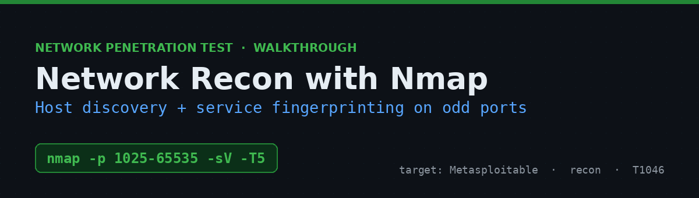
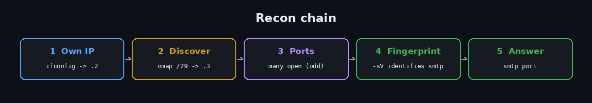
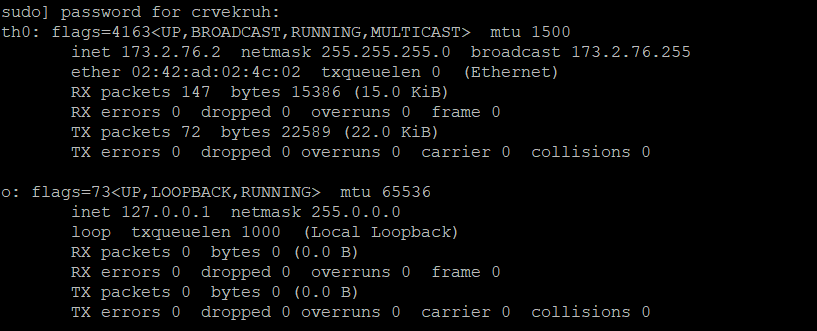
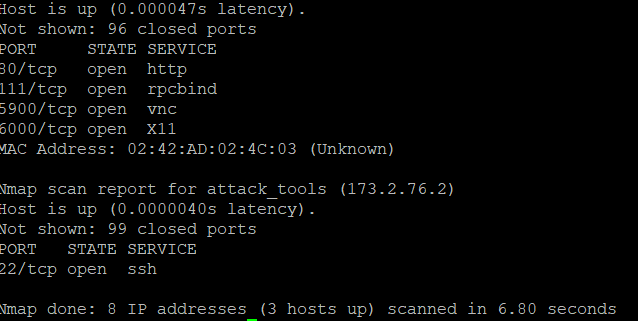
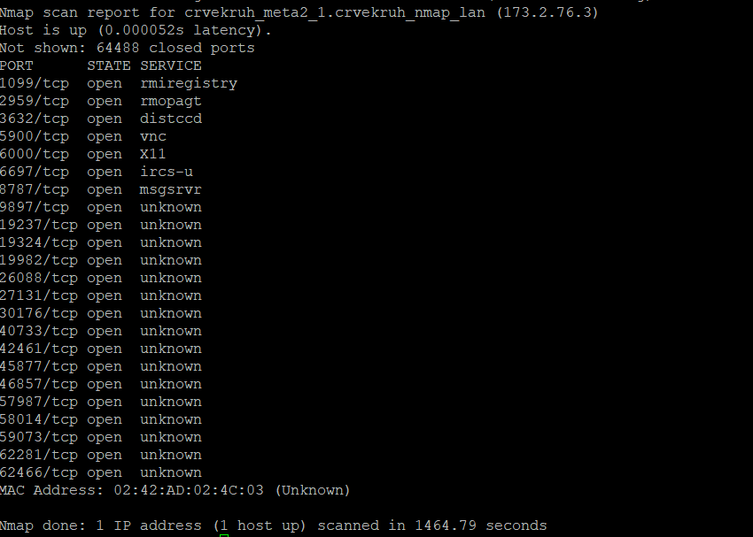
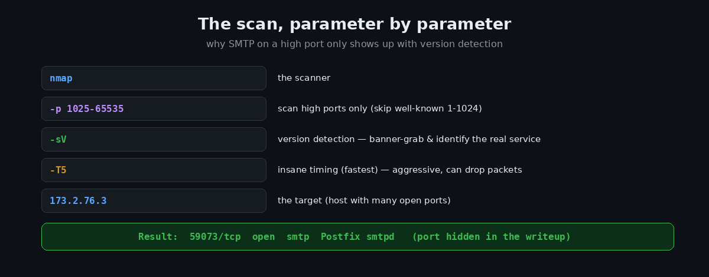
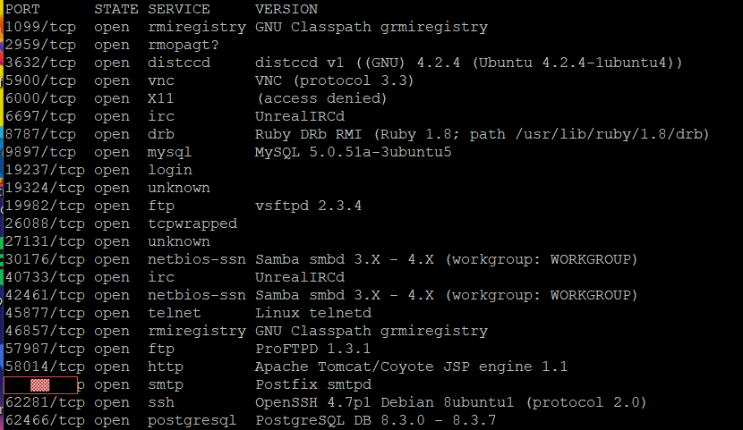

# Network Reconnaissance with Nmap — Host Discovery & Service Fingerprinting


A walkthrough of the first phase of any engagement: **finding what's on the network and what it's running**. From a provided scanning box, I discover live hosts on the local `/29`, identify the target by its large open-port footprint, then use Nmap's **version detection** to fingerprint services — including one deliberately hiding on a non-standard high port. The exercise's goal was to identify the port where **SMTP** is running (it isn't on the usual port 25).

> ⚠️ **Disclaimer** — Performed against an authorized lab target from the exercise's own scanning host. Scanning networks you don't own or have permission to test can be illegal.



---

## Table of Contents
- [TL;DR](#tldr)
- [Environment](#environment)
- [Step 1 — Find your own IP](#step-1--find-your-own-ip)
- [Step 2 — Discover live hosts](#step-2--discover-live-hosts)
- [Step 3 — Enumerate open ports](#step-3--enumerate-open-ports)
- [Step 4 — Fingerprint the services](#step-4--fingerprint-the-services)
- [What the target actually is](#what-the-target-actually-is)
- [Why it matters](#why-it-matters)
- [Remediation](#remediation)
- [Key takeaways](#key-takeaways)
- [References](#references)

---

## TL;DR

```bash
sudo ifconfig                                  # my IP -> 173.2.76.2  (subnet /24)
sudo nmap -F 173.2.76.0/29                     # host with many open ports -> 173.2.76.3
sudo nmap -p 1025-65535 -sV -T5 173.2.76.3     # version-detect the high ports
```

SMTP was running (as Postfix `smtpd`) on a **non-standard high port** — revealed only by `-sV`, since a plain scan labelled it `unknown`. That port is the answer *(redacted here)*.

---

## Environment

| | |
|---|---|
| **Scanning host** | provided attack box (`attack_tools`, 173.2.76.2) over SSH |
| **Subnet** | `173.2.76.0/29` (8 addresses) |
| **Target** | `173.2.76.3` (`crvekruh_meta2_1`) — a Metasploitable box |
| **Tool** | Nmap 7.70 |
| **Goal** | identify the port running SMTP |

Commands are in [`commands.md`](commands.md).

---

## Step 1 — Find your own IP

```bash
sudo ifconfig
```



`eth0 -> inet 173.2.76.2`, netmask `255.255.255.0`. The first three octets (`173.2.76`) define the subnet to scan.

## Step 2 — Discover live hosts

Scan the `/29` (only 8 addresses, `.0`–`.7`) and look for the host with **multiple open ports**:

```bash
sudo nmap -F 173.2.76.0/29
```



One host stood out with several open ports (`http`, `rpcbind`, `vnc`, `X11`, …) while my own box (`.2`) had only `ssh`. The target's report line identified it as **`173.2.76.3`** (`crvekruh_meta2_1`).

## Step 3 — Enumerate open ports

The `-F` scan only checks common ports, and the exercise wants a high port, so I scanned the full high range. (Tip: run this *without* `-sV` first — it's much faster, and you then version-detect only the open ports.)

```bash
sudo nmap -p 1025-65535 -T4 173.2.76.3
```



Two dozen open high ports came back — and most showed `unknown` for the service, because Nmap was only guessing from the port number. The real services were still hidden.

> The `-T5` "insane" timing the exercise specifies is the *fastest* template, but on a lossy path it tripped Nmap's retransmission cap (`giving up on port…`). `-T4` completed reliably. Either finds the ports; `-T5` is the intended "fastest" answer, `-T4` the pragmatic one.

## Step 4 — Fingerprint the services

Now version detection on the open ports turns `unknown` into real service names by banner-grabbing each one:



```bash
sudo nmap -p <open-ports> -sV 173.2.76.3
```



That's the payoff — every port resolved to a real service and version. The **SMTP** line appeared on a high port:

```
<redacted>/tcp  open  smtp  Postfix smtpd
```

That port number is the exercise answer. The lesson: SMTP normally lives on port 25, but here it's on a high port, and only `-sV` (which read the `Postfix smtpd` banner) could identify it — a plain scan had it as `unknown`.

## What the target actually is

The hostname (`meta2`) and the service list give it away: this is **Metasploitable 2**, an intentionally vulnerable VM. The `-sV` output reads like a greatest-hits of classic CVEs:

- `vsftpd 2.3.4` — the famous backdoored release (CVE-2011-2523)
- `UnrealIRCd` — backdoored build (CVE-2010-2075)
- `distccd v1` — remote code execution (CVE-2004-2687)
- `Samba 3.x` — `usermap_script` RCE (CVE-2007-2447)
- plus `MySQL`, `PostgreSQL`, Tomcat, `telnet`, VNC, and more — a huge exposed attack surface

For this exercise only the SMTP port is needed, but the fingerprint alone maps a dozen viable footholds.

## Why it matters

Reconnaissance is the foundation of an engagement. This one scan shows why:

- **Non-standard ports don't hide a service.** Moving SMTP off port 25 is security-through-obscurity; `-sV` reads the banner and identifies it anyway.
- **Version detection is the difference between "a port" and "a target."** `unknown` → `vsftpd 2.3.4` instantly turns a number into a known-exploitable service.
- **Exposed surface = risk.** Every open port is a potential entry point; this host exposes far too many.

## Remediation

- **Close or firewall unused ports** — expose only what's needed, and prefer a default-deny firewall.
- **Patch/replace outdated services** — nearly every service here has a known CVE.
- **Don't rely on non-standard ports for security** — obscurity isn't a control; `-sV` defeats it in seconds.
- **Segment and monitor** — isolate services and alert on scanning/enumeration activity.

## Key takeaways

- **Two-stage scanning is faster:** a quick port scan (no `-sV`) to find open ports, then version detection on just those — instead of `-sV` across all 64k ports.
- **Timing templates are a trade-off:** `-T5` is fastest but drops packets on lossy links (retransmission cap); `-T4` is the reliable "fast."
- **`-sV` is the star:** it read the `Postfix smtpd` banner to unmask SMTP on a non-standard port that a plain scan left as `unknown`.
- **Fingerprinting = attack-surface mapping:** one scan enumerated a dozen known-vulnerable services on the target.

## References

- Nmap — [Reference Guide](https://nmap.org/book/man.html) · [Version Detection](https://nmap.org/book/vscan.html) · [Timing & Performance](https://nmap.org/book/performance.html)
- MITRE ATT&CK — [T1046 Network Service Discovery](https://attack.mitre.org/techniques/T1046/)
- [Metasploitable 2 documentation](https://docs.rapid7.com/metasploit/metasploitable-2/)

---

<sub>A formal PDF version of this assessment is included as <code>Nmap_Recon_Report.pdf</code>. Part of my security learning portfolio.</sub>
